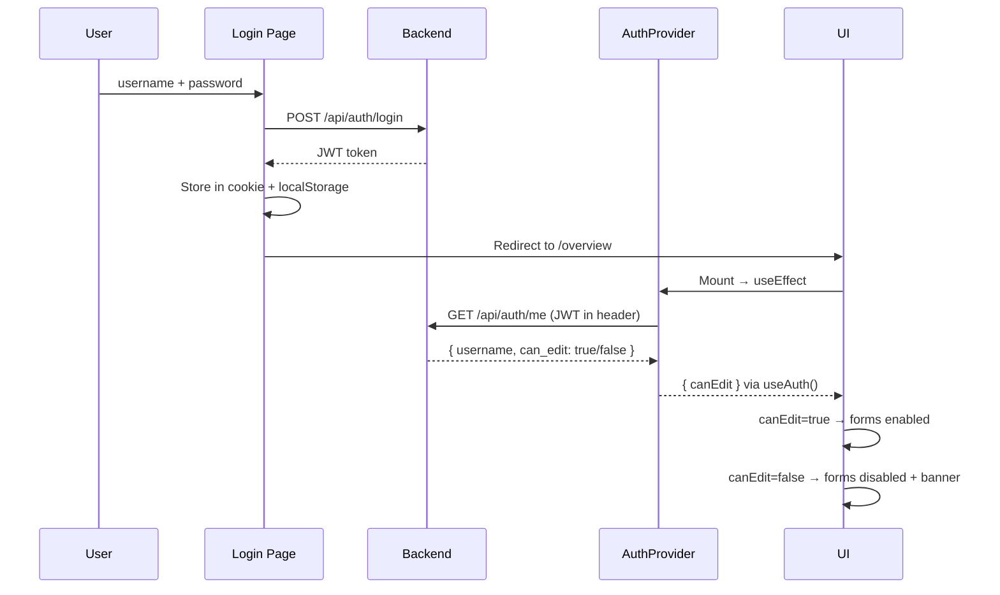
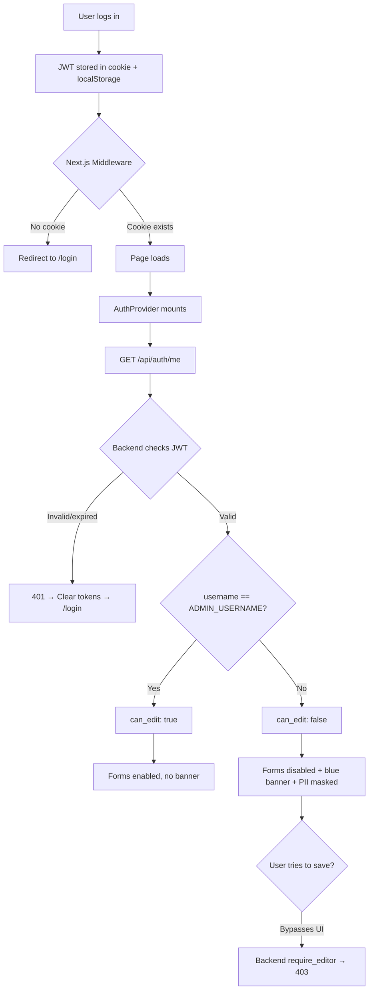

# 22. View-Only Access Control

## What Is It

View-only access control is a two-layer permission system that restricts who can modify data in the Job Tracker. Only the admin user (`rajx02`) can create, update, or delete records. Every other authenticated user gets read-only access: they see a blue informational banner at the top of every page, all form inputs and buttons are disabled, and sensitive PII (email addresses, phone numbers) are obfuscated before the data ever reaches their browser. This is enforced at two independent layers -- the **frontend** (disabled forms, hidden buttons, banner) and the **backend** (the `require_editor` dependency returns 403 on any mutation endpoint). The dual enforcement means that even if someone bypasses the UI (e.g., using curl or browser devtools), the backend still blocks the write.

---

## Beginner Box: What Is JWT?

JWT stands for **JSON Web Token**. When you log in with your username and password, the server creates a small signed token -- a string that contains your `user_id` and `username` as "claims." On every subsequent request, you send this token back in the `Authorization` header. The server verifies the cryptographic signature to confirm the token has not been tampered with -- no database lookup needed. If the signature is valid and the token has not expired, the server trusts the claims inside it and knows who you are.

---

## Architecture Diagram

The following sequence shows the full authentication and authorization flow, from login to rendering the UI in the correct mode.



The key takeaway: the backend is the single source of truth for `can_edit`. The frontend never decides on its own whether a user is an admin -- it always asks the backend via `/api/auth/me`.

---

## Backend: How It Works

The backend has three responsibilities: authenticating the user (who are you?), authorizing mutations (can you do this?), and obfuscating PII for non-editors.

### 4a. deps.py: The Auth Decision Tree

**File:** `api/api/deps.py`

```python
async def verify_auth(request, x_api_key=None, authorization=None):
    """Accept either X-API-Key (service) or Bearer JWT (UI).
    Priority:
    1. X-API-Key present + valid → allow (pipeline/service)
    2. Authorization: Bearer <token> valid → allow (UI user)
    3. API_SECRET_KEY not configured → allow all (local dev)
    4. Otherwise → 401
    """

ADMIN_USERNAME = os.getenv("ADMIN_USERNAME", "rajx02")

async def require_editor(request):
    """Block non-admin users from mutating endpoints."""
    username = getattr(request.state, "username", None)
    if not username or username != ADMIN_USERNAME:
        raise HTTPException(
            status_code=403,
            detail="View-only access — editing is restricted"
        )
```

There are two separate dependencies here, and the separation is intentional:

- **`verify_auth`** handles **authentication** -- "who are you?" It runs on ALL protected routes. It accepts two credential types: an `X-API-Key` header (used by the pipeline and other backend services) or a `Bearer` JWT token (used by UI users logging in through the browser). If neither is present and no `API_SECRET_KEY` is configured, it assumes local development and allows the request through. Otherwise, it returns 401.

- **`require_editor`** handles **authorization** -- "can you do this?" It runs only on **mutation routes** (PUT, POST, DELETE). It reads the `username` that `verify_auth` stored on `request.state` and checks whether it matches the admin username. If not, it returns 403.

Why are they separate? Because a viewer is still authenticated (they have a valid JWT), they just are not authorized to write. Combining them would mean unauthenticated users and read-only users get the same error, which makes debugging harder and provides a worse user experience.

### 4b. auth.py: The /api/auth/me Endpoint

**File:** `api/api/routers/auth.py`

```python
ADMIN_USERNAME = os.getenv("ADMIN_USERNAME", "rajx02")

@router.get("/api/auth/me", dependencies=[Depends(verify_auth)])
async def get_current_user(request):
    user_id = getattr(request.state, "user_id", None)
    username = getattr(request.state, "username", None)
    return {
        "user_id": user_id,
        "username": username,
        "can_edit": username == ADMIN_USERNAME,
    }
```

This endpoint is the bridge between backend auth and frontend rendering. The frontend calls it on every page load (via the `AuthProvider`) to learn two things: who the user is and whether they can edit.

The `can_edit` field is a simple boolean derived from a string comparison: does the username match the admin username? The admin username comes from the `ADMIN_USERNAME` environment variable, which defaults to `rajx02`. This means you can change the admin user without touching code -- just update the env var and restart the server.

Note that `dependencies=[Depends(verify_auth)]` means this endpoint requires a valid JWT. An unauthenticated request gets a 401 before this function even runs.

### 4c. profiles.py: PII Obfuscation for Viewers

**File:** `api/api/routers/profiles.py`

```python
is_editor = getattr(request.state, "username", None) == ADMIN_USERNAME

if not is_editor and config:
    # Email: "ravi@gmail.com" → "r***@gmail.com"
    if config.get("candidate", {}).get("email"):
        e = config["candidate"]["email"]
        at_idx = e.find("@")
        config["candidate"]["email"] = (
            e[0] + "***" + e[at_idx:] if at_idx > 0 else "***"
        )
    # Phone: "9876543210" → "987***210"
    if config.get("candidate", {}).get("phone"):
        p = config["candidate"]["phone"]
        config["candidate"]["phone"] = (
            p[:3] + "***" + p[-3:] if len(p) > 6 else "***"
        )
```

When a non-admin user views the profile, the server masks email addresses and phone numbers **before sending them in the response**. This is a critical design choice: the masking happens server-side, not client-side.

Why does this matter? If you mask in the frontend (e.g., replacing characters in a React component), the full unmasked data is still visible in the browser's Network tab. Anyone can open DevTools, find the API response, and read the real email or phone number. By masking on the server, the full PII never leaves the backend -- it is impossible to recover from the browser.

The masking rules are simple:
- **Email:** Keep the first character and everything from the `@` sign onward. Replace the middle with `***`. So `ravi@gmail.com` becomes `r***@gmail.com`.
- **Phone:** Keep the first three digits and the last three digits. Replace the middle with `***`. So `9876543210` becomes `987***210`.
- **Short values:** If the email has no `@` or the phone has six or fewer characters, replace the entire value with `***` to avoid leaking too much.

---

## Frontend: How It Works

The frontend has four pieces: the `AuthProvider` (fetches and stores the `canEdit` boolean), the `ViewOnlyBanner` (shows the blue banner), the middleware (cookie-based route guard), and the dashboard pages themselves (disabled forms).

### 5a. use-auth.tsx: The AuthProvider

**File:** `src/hooks/use-auth.tsx`

```typescript
interface AuthContextValue {
  username: string | null;
  canEdit: boolean;
  isLoading: boolean;
}

export function AuthProvider({ children }) {
  const [state, setState] = useState({
    username: null,
    canEdit: false,
    isLoading: true,
  });

  useEffect(() => {
    async function fetchAuth() {
      const h = { "X-API-Key": API_KEY };
      const token = localStorage.getItem("auth_token");
      if (token) h["Authorization"] = `Bearer ${token}`;

      const resp = await fetch(`${API_BASE}/api/auth/me`, { headers: h });
      if (!resp.ok) {
        // JWT expired → clear credentials and redirect to login
        if (resp.status === 401 && token) {
          localStorage.removeItem("auth_token");
          localStorage.removeItem("auth_username");
          document.cookie = "auth_token=; path=/; max-age=0";
          window.location.href = "/login";
          return;
        }
        setState({ username: null, canEdit: false, isLoading: false });
        return;
      }
      const data = await resp.json();
      setState({
        username: data.username,
        canEdit: data.can_edit,
        isLoading: false,
      });
    }
    fetchAuth();
  }, []);

  return (
    <AuthContext.Provider value={state}>{children}</AuthContext.Provider>
  );
}

export function useAuth() {
  return useContext(AuthContext);
}
```

The `AuthProvider` is a React context provider that wraps the entire application. On mount, it fires a single `GET /api/auth/me` request. The response tells it the user's `username` and whether `can_edit` is true or false. This data is then available to every component in the tree via the `useAuth()` hook.

There are three states:

1. **Loading** (`isLoading: true`) -- the `/api/auth/me` request is in flight. Components should show a loading indicator or skip rendering conditional UI.
2. **Authenticated admin** (`canEdit: true`) -- the user is the admin. Forms are enabled, no banner appears.
3. **Authenticated viewer** (`canEdit: false`) -- the user is logged in but is not the admin. Forms are disabled, the banner appears, PII is masked.

The 401 handling is important: if the JWT has expired but the cookie still exists (so middleware let the request through), the `AuthProvider` catches the 401, clears **both** localStorage and the cookie, and redirects to `/login`. This prevents the user from getting stuck in a broken state where the page loads but all API calls fail.

### 5b. app-shell.tsx: ViewOnlyBanner

**File:** `src/components/layout/app-shell.tsx`

```typescript
function ViewOnlyBanner() {
  const { canEdit, isLoading } = useAuth();
  if (isLoading || canEdit) return null;
  return (
    <div className="flex items-center gap-2 bg-blue-50 border-b border-blue-200 px-4 py-2 text-sm text-blue-700">
      <Lock className="h-4 w-4 shrink-0" />
      <span>
        View-only mode — you can browse but cannot make changes.
      </span>
    </div>
  );
}
```

The banner is intentionally minimal and informational. A few design decisions to note:

- **Blue colors** (`bg-blue-50`, `border-blue-200`, `text-blue-700`) signal "informational" -- not "error" (red) or "warning" (amber). Being a viewer is not an error; it is an expected state.
- **Lock icon** provides a visual affordance that reinforces the "read-only" message.
- **Renders inside `AppShell`** so it appears on every page automatically. Individual pages do not need to know about it.
- **Returns `null` during loading** to avoid a flash of the banner before the auth state is known.
- **Returns `null` for admins** so the admin never sees it.

### 5c. middleware.ts: Cookie-Based Route Guard

**File:** `src/middleware.ts`

```typescript
export function middleware(request) {
  const { pathname } = request.nextUrl;

  // Allow public paths like /login
  if (PUBLIC_PATHS.some((p) => pathname.startsWith(p))) {
    return NextResponse.next();
  }

  // Check for auth cookie
  const token = request.cookies.get("auth_token")?.value;
  if (!token) {
    return NextResponse.redirect(new URL("/login", request.url));
  }

  return NextResponse.next();
}
```

Next.js middleware runs on the **edge** -- before the page even starts rendering. It has one job: check if the user has an `auth_token` cookie. If not, redirect them to `/login`.

Why a cookie and not localStorage? Middleware runs in a serverless edge environment that has no access to the browser's `window` object or `localStorage`. Cookies are the only client-side storage mechanism that is automatically sent with every request and accessible in middleware.

This is why the login page stores the JWT in **both** places:
- **Cookie** -- for middleware to check (route guard).
- **localStorage** -- for client-side JavaScript to read and attach to API calls as `Authorization: Bearer <token>`.

The middleware does not check if the JWT is valid or expired -- that is the backend's job. It only checks if a cookie exists. This is a deliberate simplification: validating a JWT in edge middleware would require the secret key to be available at the edge, which adds complexity.

### 5d. Dashboard Pages: Disabling Forms

**File:** `src/app/(dashboard)/settings/page.tsx`

```typescript
const { canEdit } = useAuth();

// Wrap entire form in disabled fieldset
<fieldset disabled={!canEdit} className="space-y-6">
  <Tabs ...>
    ...all form content...
  </Tabs>
</fieldset>

// Save button also explicitly disabled
<Button disabled={!canEdit || saveMutation.isPending}>
  Save Profile
</Button>
```

The `<fieldset disabled>` pattern is a native HTML feature that has been around since HTML 4. When you set `disabled` on a `<fieldset>`, the browser automatically disables **every** form element inside it -- inputs, selects, textareas, buttons, everything. This is far more reliable than disabling each input individually because:

1. You cannot forget an input. If it is inside the fieldset, it is disabled.
2. You do not need to thread a `canEdit` prop down through every child component.
3. It works with third-party UI components that render standard HTML form elements.

The save button gets an explicit `disabled={!canEdit}` as a second layer of defense. Even though it is inside the disabled fieldset, the explicit prop makes the intent clear to anyone reading the code and provides an extra safeguard if the button is ever moved outside the fieldset.

---

### 5e. Login Page: Profile ID Sync

**File:** `src/app/(auth)/login/page.tsx`

```typescript
// After storing JWT...
document.cookie = `auth_token=${token}; path=/; max-age=${60 * 60 * 24}; SameSite=Lax`;
localStorage.setItem("auth_token", token);
localStorage.setItem("auth_username", user);

// Fetch profile to sync profile_id in localStorage
try {
  const profileRes = await fetch(`${API_BASE}/api/profiles/me`, {
    headers: { "X-API-Key": API_KEY, Authorization: `Bearer ${token}` },
  });
  if (profileRes.ok) {
    const profileData = await profileRes.json();
    if (profileData.profile?.id) {
      localStorage.setItem("job-tracker-profile-id", String(profileData.profile.id));
    }
  }
} catch {
  // Non-critical — profile_id will sync when user visits Settings
}
```

Every dashboard page uses a `profileId` (stored in localStorage via `ProfileProvider`) to query data -- applications, analytics, tracker rows, etc. If the `profileId` in localStorage does not match the user's actual profile in the database, every page shows empty data even though the backend is healthy.

This mismatch can happen when a user registers (creating a new profile with a new `id`) but localStorage still has a stale `profileId` from a previous session or a different user.

The fix: immediately after login, we fetch `GET /api/profiles/me` using the fresh JWT and store the returned `profile.id` in localStorage. This ensures the `ProfileProvider` always has the correct `profileId` from the first page load -- the user never sees empty pages.

The fetch is wrapped in a `try/catch` with no error handling because it is non-critical. If it fails (e.g., the profile has not been created yet for a new user), the Settings page will sync the `profileId` when the user visits it. The login flow is not blocked by this fetch failing.

---

## File Map

| File | Layer | Role |
|---|---|---|
| `api/api/deps.py` | Backend | `verify_auth()` (authentication) + `require_editor()` (authorization) |
| `api/api/routers/auth.py` | Backend | Login, register, `GET /api/auth/me` (returns `can_edit`) |
| `api/api/routers/profiles.py` | Backend | PII obfuscation (email/phone masking) for non-editors |
| `api/core/auth.py` | Backend | JWT create/decode helper functions |
| `ui-next/src/hooks/use-auth.tsx` | Frontend | `AuthProvider` context + `useAuth()` hook |
| `ui-next/src/components/layout/app-shell.tsx` | Frontend | `ViewOnlyBanner` + provider hierarchy |
| `ui-next/src/middleware.ts` | Frontend | Cookie-based route guard (edge middleware) |
| `ui-next/src/app/(auth)/login/page.tsx` | Frontend | Login form, stores JWT in cookie + localStorage, syncs `profileId` |
| `ui-next/src/app/(dashboard)/settings/page.tsx` | Frontend | `<fieldset disabled>` pattern for form disabling |

---

## Data Flow Diagram

This flowchart shows every decision point from login to final UI rendering, including what happens when tokens expire or a non-admin tries to bypass the UI.



Notice the two exit points for unauthorized access: the middleware catches users with no cookie at all (step C), and the `AuthProvider` catches users whose JWT has expired (step H). For users who are authenticated but not the admin, the UI disables forms (step N) and the backend blocks mutations as a final safety net (step P).

---

## Common Gotchas

### 1. Cookie vs localStorage sync

The JWT is stored in **both** a cookie (for Next.js middleware) and localStorage (for API call headers). If one gets cleared but not the other, the user ends up in an inconsistent state: middleware might pass them through (cookie exists) but API calls fail (no token in localStorage), or vice versa.

The `AuthProvider`'s 401 handler fixes this by clearing **both** storage locations when it detects an expired token:

```typescript
localStorage.removeItem("auth_token");
localStorage.removeItem("auth_username");
document.cookie = "auth_token=; path=/; max-age=0";
window.location.href = "/login";
```

If you add a new place where tokens are cleared (e.g., a "Log Out" button), make sure it clears both.

### 2. Why the Settings page was logging users out

The Settings page calls `GET /api/profiles/me`, which uses `_get_user_id()` to extract the user ID from the JWT. Other dashboard pages (overview, applications, analytics) only need the API key and a `profile_id` query parameter -- they do not parse the JWT at all.

This meant that when the JWT expired, most pages continued working fine (the API key was still valid), but the Settings page returned 401 because it needed the JWT specifically. The 401 triggered the `AuthProvider`'s logout logic, and the user was unexpectedly redirected to `/login`.

The fix was adding 401 detection in the `AuthProvider` so it handles expired tokens gracefully before individual pages hit the problem.

### 3. require_editor is separate from verify_auth

This is a common source of confusion. `verify_auth` asks "are you logged in?" and goes on **all** protected routes (GET, PUT, POST, DELETE). `require_editor` asks "are you the admin?" and goes **only** on mutation routes (PUT, POST, DELETE).

Do not combine them into a single dependency. If you did, non-admin users would get 403 errors on read-only GET endpoints too, which defeats the purpose of view-only access.

```python
# Correct: separate concerns
@router.get("/api/data", dependencies=[Depends(verify_auth)])        # viewers OK
@router.put("/api/data", dependencies=[Depends(verify_auth), Depends(require_editor)])  # admin only

# Wrong: combined into one
@router.get("/api/data", dependencies=[Depends(require_admin_auth)])  # blocks viewers from reading
```

### 4. PII obfuscation is server-side

If you are tempted to mask email or phone in a React component (e.g., `{email.replace(/.(?=.{4})/g, "*")}`), stop. The full unmasked data would still be in the API response, visible in the browser's Network tab to anyone who opens DevTools.

The backend masks the data in `profiles.py` **before** sending the response. The raw PII never reaches the browser for non-admin users.

### 5. Profile ID mismatch after registration

When a new user registers, the backend creates a fresh profile with a new `id`. But if `localStorage` still has a stale `job-tracker-profile-id` from a previous session, the `ProfileProvider` will use the old value, and every data query will hit the wrong (or empty) profile. All pages show skeleton loaders or "no data found" even though the backend is healthy and returning data.

The login page now syncs the profile_id immediately after authentication (see section 5e above). If you are debugging empty pages for a logged-in user, check `localStorage.getItem("job-tracker-profile-id")` in the browser console -- it should match the profile `id` in the database.

### 6. ADMIN_USERNAME env var

The admin username defaults to `rajx02` but can be changed via the `ADMIN_USERNAME` environment variable. Be aware that **both** `deps.py` and `auth.py` read this env var independently using `os.getenv("ADMIN_USERNAME", "rajx02")`. If you set the env var in one service but not the other (e.g., in a split deployment), they could disagree on who the admin is.

Always ensure the `ADMIN_USERNAME` env var is set consistently across all backend instances.
