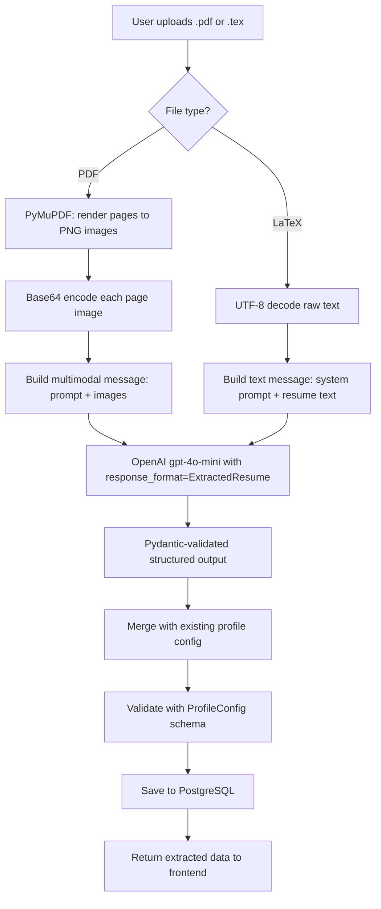
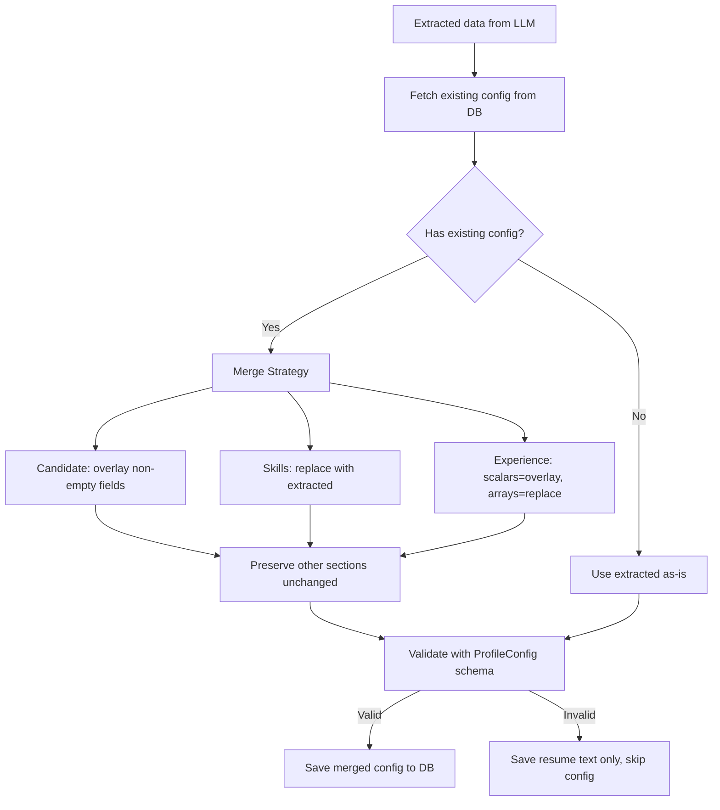

# 23. Resume Extraction Pipeline

## What Is It

Users upload a PDF or LaTeX (`.tex`) resume through the Settings page. The backend extracts structured data from it using OpenAI's structured outputs -- vision mode for PDFs (page images sent to the multimodal API), text mode for LaTeX (raw source sent as a string). The extracted data is validated against a hierarchy of Pydantic models that define every field the system expects (name, email, skills, work history, etc.). Once validated, the data is auto-merged into the user's existing profile config using a strategy that preserves manual edits while updating resume-sourced fields. The merged config is saved to PostgreSQL, and the frontend's settings form is automatically populated with the extracted information -- no manual data entry required.

---

## Beginner Box: What Are Structured Outputs?

Normally when you ask an LLM to return JSON, you *hope* it follows your format. Sometimes it does not -- missing fields, wrong types, extra explanatory text wrapped around the JSON. You end up writing brittle parsing code full of `try/except` and `.get()` calls. OpenAI's **structured outputs** solve this problem entirely: you give it a Pydantic model (a Python class that defines your expected schema with field names, types, and constraints), and OpenAI **guarantees** the response matches that schema exactly. Every field will be present, every type will be correct, and there will be no extra text.

In code, instead of calling `client.chat.completions.create()` and parsing raw text, you call:

```python
client.beta.chat.completions.parse(
    model="gpt-4o-mini",
    messages=[...],
    response_format=YourPydanticModel,  # The schema you want
)
```

The response object has a `.parsed` attribute that is a fully typed Python object -- not a string, not a dict, but an actual instance of `YourPydanticModel` with autocomplete, type checking, and all the guarantees Pydantic provides.

This is the foundation of the entire resume extraction pipeline. Without structured outputs, we would need to parse free-form LLM text into 20+ fields across 5 nested objects -- a fragile nightmare. With structured outputs, the LLM does the extraction AND the formatting in one step.

---

## Architecture Diagram



The two paths (PDF and LaTeX) converge at the OpenAI call. From that point on, the downstream logic is identical regardless of the input format. This is the key design choice -- normalize everything into a single `ExtractedResume` Pydantic model, then handle merging and saving uniformly.

---

## The Pydantic Models

The extraction schema is a hierarchy of five Pydantic models. The top-level model (`ExtractedResume`) contains three sections, each with its own model. This mirrors the structure of the profile config stored in the database.

**File:** `api/api/resume_parser.py`

```python
class ExtractedCandidate(BaseModel):
    name: str          # "Ravi Raj"
    email: str         # "ravi@gmail.com"
    phone: str         # "9876543210"
    github: str        # "github.com/ravi"
    linkedin: str      # "linkedin.com/in/ravi"
    portfolio: str     # "" (empty if not found)
    location: str      # "Bengaluru, India"
    timezone: str      # "Asia/Kolkata"

class ExtractedSkills(BaseModel):
    primary: list[str]    # ["Python", "React", "FastAPI"]
    secondary: list[str]  # ["PostgreSQL", "Docker", "Redis"]
    frameworks: list[str] # ["LangChain", "OpenAI", "RAG"]

class ExtractedWorkHistory(BaseModel):
    company: str      # "TCS"
    role: str         # "Software Engineer"
    duration: str     # "Jun 2024 – Sep 2024"
    type: str         # "full_time" | "internship" | "freelance" | "contract"
    tech: list[str]   # ["Python", "Django"]
    description: str  # What they did
    projects: list[ExtractedWorkProject]

class ExtractedExperience(BaseModel):
    years: int                           # Total years of experience
    graduation_year: int                 # 2024
    degree: str                          # "B.Tech Computer Science"
    gap_explanation: str                 # Why there's a gap (if any)
    work_history: list[ExtractedWorkHistory]
    gap_projects: list[ExtractedGapProject]

class ExtractedResume(BaseModel):       # Top-level model
    candidate: ExtractedCandidate
    skills: ExtractedSkills
    experience: ExtractedExperience
```

`ExtractedResume` is the top-level model that gets passed to `response_format` in the OpenAI call. OpenAI guarantees the response matches this EXACT schema -- every field present, correct types, no extras. The nested structure mirrors how the profile config is stored in the database, which makes the merge step straightforward: each section maps directly to a key in the JSON config.

Notice that every field has a simple type (`str`, `int`, `list[str]`). This is intentional. Structured outputs work best with flat, unambiguous types. Complex types like `Optional[Union[str, int]]` can confuse the model and lead to extraction errors.

---

## PDF Extraction Path

PDFs are the most common resume format, but they are also the hardest to extract data from. The pipeline converts each PDF page into an image and sends those images to GPT-4o-mini's vision API. This three-step process handles even the most complex layouts.

### Step 1: PDF Pages to Images

**File:** `api/api/resume_parser.py`

```python
async def pdf_pages_to_base64_images(file_content: bytes, dpi: int = 150) -> list[str]:
    """Convert each PDF page to a base64-encoded PNG image."""
    import fitz  # PyMuPDF

    doc = fitz.open(stream=file_content, filetype="pdf")
    images = []
    for page in doc:
        pix = page.get_pixmap(dpi=dpi)
        png_bytes = pix.tobytes("png")
        images.append(base64.b64encode(png_bytes).decode("utf-8"))
    doc.close()
    return images
```

Why images instead of text? PDF text extraction is notoriously unreliable. Tables break apart, multi-column layouts merge into nonsensical single-column text, and formatting context (bold headers, section dividers, indentation) is completely lost. By sending page **images** to GPT-4o-mini's vision API, the LLM sees the resume exactly as a human would -- columns stay columned, tables stay tabled, and section headers are visually distinct from body text.

The `dpi=150` setting balances image quality against file size. At 150 DPI, a typical one-page resume produces a ~200KB PNG -- large enough for the model to read every word, small enough to stay well within API limits.

### Step 2: Build Multimodal Message

**File:** `api/api/resume_parser.py`

```python
content = [{"type": "text", "text": prompt}]
for b64_img in images:
    content.append({
        "type": "image_url",
        "image_url": {"url": f"data:image/png;base64,{b64_img}", "detail": "high"},
    })
```

The multimodal message has the text prompt first, then each page as a base64-encoded image. The `"detail": "high"` parameter tells the API to process at full resolution rather than downscaling. This is critical for resumes where small text (dates, phone numbers, URLs) must be read accurately.

The message structure is a single `user` message with mixed content types. OpenAI's API accepts an array of content blocks inside one message -- you do not need separate messages for text and images.

### Step 3: Call OpenAI with Structured Output

**File:** `api/api/resume_parser.py`

```python
client = AsyncOpenAI(api_key=OPENAI_API_KEY)
completion = await client.beta.chat.completions.parse(
    model="gpt-4o-mini",
    messages=[{"role": "user", "content": content}],
    response_format=ExtractedResume,  # Pydantic model as schema
    temperature=0.1,                   # Low temp for deterministic extraction
    max_tokens=3000,
    name="resume-extraction-pdf",
)

parsed = completion.choices[0].message.parsed  # Typed ExtractedResume object
return parsed.model_dump()                      # Convert to dict
```

`client.beta.chat.completions.parse()` is the structured outputs API. Unlike regular `chat.completions.create()`, it returns a Pydantic object, not raw text. The `.parsed` attribute is an actual `ExtractedResume` instance with all fields populated and type-checked. Calling `.model_dump()` converts it to a plain Python dict for JSON serialization.

Temperature `0.1` keeps extraction deterministic. For creative writing you want high temperature (randomness). For structured data extraction, you want the model to pick the single most likely value for each field every time.

---

## LaTeX Extraction Path

**File:** `api/api/resume_parser.py`

```python
async def extract_profile_from_tex(resume_text: str) -> dict:
    prompt = _get_extraction_prompt()
    client = AsyncOpenAI(api_key=OPENAI_API_KEY)
    completion = await client.beta.chat.completions.parse(
        model="gpt-4o-mini",
        messages=[
            {"role": "system", "content": prompt},
            {"role": "user", "content": f"Resume (LaTeX source):\n\n{resume_text[:12000]}"},
        ],
        response_format=ExtractedResume,
        temperature=0.1,
        max_tokens=3000,
        name="resume-extraction-tex",
    )
    parsed = completion.choices[0].message.parsed
    return parsed.model_dump()
```

LaTeX is already text, so no image conversion is needed. GPT-4o-mini reads LaTeX natively -- it understands `\section{}`, `\textbf{}`, `\begin{itemize}`, `\href{}{}`, and all the common resume template commands. The raw `.tex` source is sent directly as a string.

The text is capped at 12,000 characters (`resume_text[:12000]`) to stay within token limits. Most resumes are under 5,000 characters, but some LaTeX files include verbose package imports, custom command definitions, and preamble boilerplate that inflate the character count.

**Key difference from the PDF path:** PDF uses a single `user` message with mixed content (text prompt + images). LaTeX uses two separate messages -- a `system` message containing the extraction prompt and a `user` message containing the resume text. The system message helps the model distinguish instructions from data. With the PDF path, the prompt and images are co-located in one message because the vision API requires images in the user message.

---

## Langfuse Integration

The pipeline integrates with Langfuse for two purposes: **prompt management** (storing and versioning the extraction prompt externally) and **auto-tracing** (logging every OpenAI call for observability).

### Prompt Management

**File:** `api/api/resume_parser.py`

```python
def _get_extraction_prompt() -> str:
    """Fetch the resume-extraction prompt from Langfuse. Raises on failure."""
    from langfuse import Langfuse

    public_key = os.getenv("LANGFUSE_PUBLIC_KEY", "")
    secret_key = os.getenv("LANGFUSE_SECRET_KEY", "")
    if not public_key or not secret_key:
        raise ValueError(
            "LANGFUSE_PUBLIC_KEY and LANGFUSE_SECRET_KEY must be set — "
            "resume extraction prompt is managed in Langfuse"
        )

    client = Langfuse(public_key=public_key, secret_key=secret_key, host=...)
    prompt = client.get_prompt("resume-extraction", type="text", cache_ttl_seconds=300)
    compiled = prompt.compile()
    return compiled
```

There is **no fallback prompt** in the code. The prompt MUST come from Langfuse. This is intentional -- prompts are treated as living documents that can be versioned, A/B tested, and updated without code deploys. If you need to tweak the extraction instructions (e.g., "classify internships differently" or "extract certifications too"), you edit the prompt in the Langfuse dashboard and the next API call picks it up automatically.

The `cache_ttl_seconds=300` means the prompt is cached locally for 5 minutes. During those 5 minutes, repeated calls to `_get_extraction_prompt()` return the cached version without hitting the Langfuse API. After 5 minutes, it fetches the latest version. This balances freshness against latency.

### Auto-Tracing

**File:** `api/api/resume_parser.py`

```python
# At the top of resume_parser.py:
try:
    from langfuse.openai import AsyncOpenAI  # Langfuse-wrapped client
except ImportError:
    from openai import AsyncOpenAI  # Regular client if Langfuse not installed
```

`langfuse.openai.AsyncOpenAI` is a **drop-in replacement** for the standard OpenAI client. It wraps every API call and automatically logs the full request and response to the Langfuse dashboard -- prompt text, completion text, latency, token counts, cost estimate, model name, and any metadata you attach. No other code changes are needed. You use `client.beta.chat.completions.parse(...)` exactly the same way; the tracing happens transparently behind the scenes.

If the `langfuse` package is not installed (e.g., in a minimal dev environment), the import falls back to the standard `openai.AsyncOpenAI` and everything still works -- you just lose the tracing.

---

## The Extraction Prompt (7 Rules of Prompt Engineering)

The prompt stored in Langfuse (and pushed via `pipeline/scripts/push_prompts.py`) follows seven established rules for effective LLM prompts:

1. **Role/Persona** -- "You are an expert resume parser..." sets the model's behavior context. Without this, the model might respond conversationally instead of extracting data.

2. **Specificity** -- The prompt lists exact field names, expected types, and formats. Instead of "extract the candidate's info", it says "extract `name` (string, full name as written), `email` (string, primary email address), `phone` (string, digits only)...".

3. **Few-shot examples** -- The prompt includes a correct extraction example showing a sample resume snippet and the expected structured output. This grounds the model's understanding of what "good" looks like.

4. **Output format** -- Enforced by the Pydantic model passed via `response_format=ExtractedResume`. The prompt does not need to describe JSON structure because structured outputs handle that automatically.

5. **Delimiters/Structure** -- The instructions are organized as step-by-step numbered sections. This prevents the model from skipping steps or conflating instructions.

6. **Chain-of-thought** -- "Analyze the resume section by section: first identify the candidate header, then the skills section, then work experience..." guides the model through a logical extraction order.

7. **Constraints + Self-check** -- "Before returning, verify: all fields populated, no hallucinated data, skills correctly classified as primary/secondary/frameworks." This acts as a final sanity check that catches common errors.

---

## Auto-Save Merge Logic

When the extraction completes, the pipeline does not simply overwrite the existing profile config. It uses a **merge strategy** that respects both the extracted data and any manual edits the user has previously made.

**File:** `api/api/routers/profiles.py`

```python
# 1. Fetch existing config from DB
existing_config = json.loads(existing["config"]) if existing else {}

# 2. Merge candidate (overlay: only replace non-empty extracted fields)
merged_candidate = existing_config.get("candidate", {})
for key in ("name", "email", "phone", "github", "linkedin", "portfolio", "location", "timezone"):
    val = ext_candidate.get(key, "")
    if val:
        merged_candidate[key] = val

# 3. Merge skills (replace: extraction wins entirely)
merged_skills = {
    "primary": ext_skills.get("primary", []) or existing_config.get("skills", {}).get("primary", []),
    "secondary": ext_skills.get("secondary", []) or existing_config.get("skills", {}).get("secondary", []),
    "frameworks": ext_skills.get("frameworks", []) or existing_config.get("skills", {}).get("frameworks", []),
}

# 4. Merge experience (scalars=overlay, arrays=replace)
merged_experience = existing_config.get("experience", {})
if ext_experience.get("work_history"):
    merged_experience["work_history"] = ext_experience["work_history"]  # Replace
if ext_experience.get("years"):
    merged_experience["years"] = ext_experience["years"]  # Overlay

# 5. Preserve other sections (filters, cold_email, matching, etc.)
existing_config["candidate"] = merged_candidate
existing_config["skills"] = merged_skills
existing_config["experience"] = merged_experience

# 6. Validate and save
validated = ProfileConfig(**existing_config)
```

### Merge Strategy Diagram



### Understanding the Three Merge Strategies

**Overlay** (used for candidate fields like name, email, phone): Only overwrite a field if the extracted value is non-empty. If the LLM could not find a portfolio URL and returns `""`, the user's previously entered portfolio URL is preserved. This prevents extraction gaps from erasing manual data.

**Replace** (used for skills and work_history arrays): The extraction wins entirely. The resume is the source of truth for what skills someone has and where they have worked. If the user manually added "Kubernetes" to their skills but it is not on the resume, it gets replaced. The rationale: the resume should be the canonical record. If the user wants to add extra skills, they can do so after extraction.

**Preserve** (used for filters, cold_email, matching, and other preference sections): These config sections are user preferences -- job search filters, email templates, matching thresholds. They have nothing to do with resume content and are never touched by the extraction pipeline. Even a full re-extraction leaves them intact.

---

## File Map

| File | Layer | Role |
|---|---|---|
| `api/api/resume_parser.py` | Backend | Pydantic models, PDF-to-image conversion, LLM extraction calls |
| `api/api/routers/profiles.py` | Backend | Upload endpoint, auto-save merge logic |
| `api/api/profile_schema.py` | Backend | `ProfileConfig` validation schema |
| `pipeline/scripts/push_prompts.py` | Pipeline | Push extraction prompt to Langfuse |
| `ui-next/src/hooks/use-resume-upload.tsx` | Frontend | Global upload context provider (state, progress, error handling) |
| `ui-next/src/app/(dashboard)/settings/components/resume-upload.tsx` | Frontend | Upload UI component (drag-and-drop, file picker, progress bar) |
| `ui-next/src/app/(dashboard)/settings/page.tsx` | Frontend | Settings page that consumes extracted data to populate form fields |
| `ui-next/src/lib/api.ts` | Frontend | `uploadResume()` API function (multipart form upload) |

---

## Common Gotchas

1. **PyMuPDF vs PyPDF2** -- Both libraries are used in the codebase and they serve different purposes. PyMuPDF (imported as `fitz`) renders PDF pages to images for the vision extraction pipeline. PyPDF2 extracts raw text from PDFs for storage in the database as a searchable string. Do not confuse them or try to replace one with the other.

2. **12K character cap on LaTeX** -- The expression `resume_text[:12000]` in the LaTeX path prevents token overflow. Most resumes are under 5,000 characters, but some LaTeX files include lengthy package imports, custom macro definitions, and preamble boilerplate that can inflate the file well beyond what the model's context window can handle efficiently. The cap is a safety net, not a limitation you should hit in practice.

3. **`auto_saved` flag** -- The API response includes an `auto_saved: true` or `auto_saved: false` field. If `ProfileConfig` validation fails after the merge (e.g., the LLM returned an unexpected value that does not fit the schema), `auto_saved` is `false` and only the raw resume text is saved to the database -- the config is left unchanged. The frontend checks this flag to decide whether to refresh the settings form.

4. **No fallback prompt** -- If Langfuse is down, misconfigured, or the environment variables `LANGFUSE_PUBLIC_KEY` and `LANGFUSE_SECRET_KEY` are not set, the extraction will **fail with a ValueError**. This is intentional -- the prompt is managed externally and there is no hardcoded fallback. If you are setting up a new development environment, you must configure Langfuse credentials or the resume upload feature will not work.

5. **Temperature 0.1** -- The extraction calls use `temperature=0.1`, which is near-zero. This makes the model's output highly deterministic -- the same resume uploaded twice will produce the same extraction. Higher temperatures introduce randomness that is harmful for structured data extraction (you do not want the model to "creatively" guess a phone number). The value is `0.1` rather than `0.0` because a tiny amount of temperature helps the model avoid getting stuck in degenerate outputs for ambiguous fields.

6. **Vision vs text for PDF** -- The pipeline sends page images (not extracted text) to the LLM for PDF resumes. This is more expensive in terms of API tokens (images cost significantly more than text), but it is MUCH more accurate for complex layouts with tables, multi-column designs, sidebars, icons, and non-standard formatting. If cost is a concern, the DPI can be lowered from 150, but accuracy will degrade for dense resumes.
