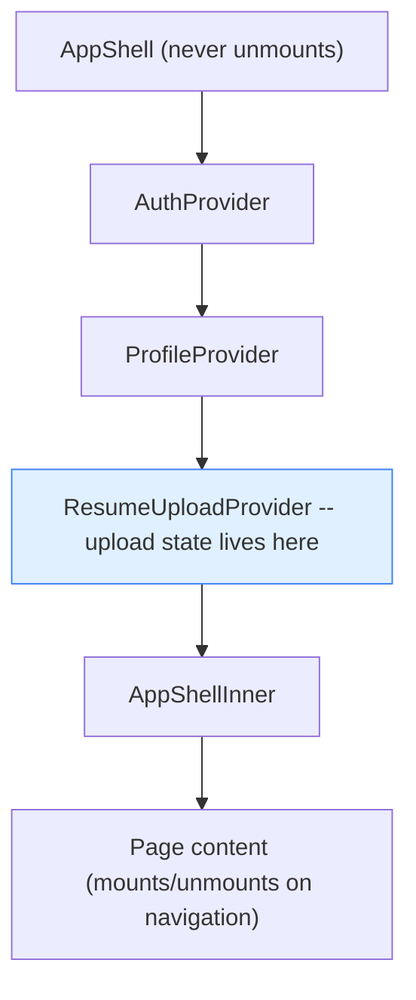
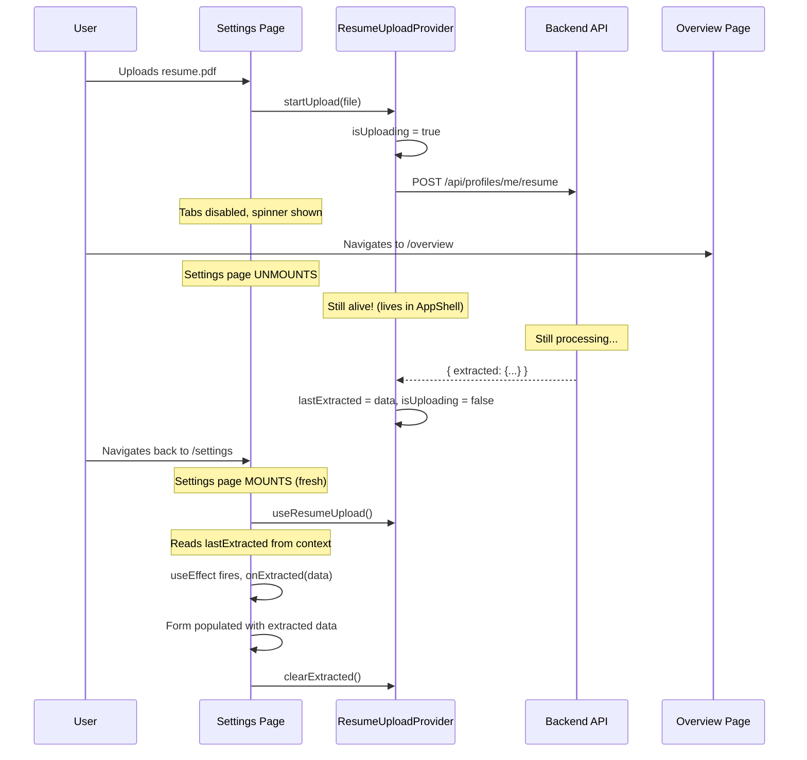
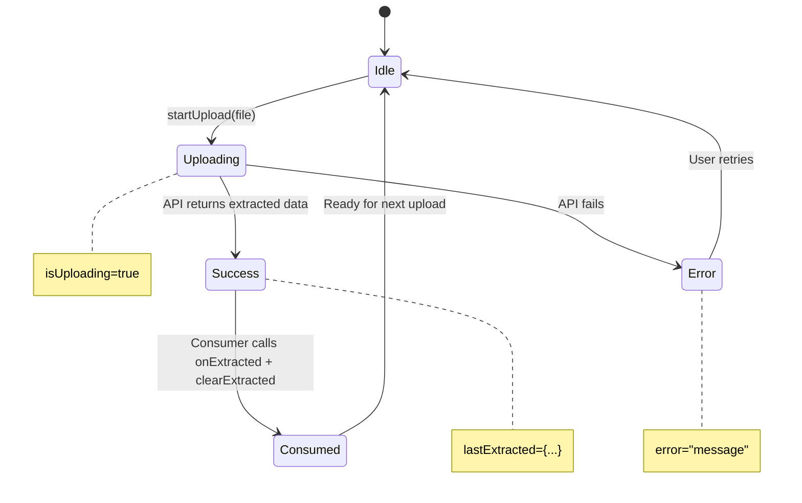

# 24. Global Upload State Management

## What Is It

When a user uploads a resume on the Settings page, the backend runs LLM extraction that takes several seconds to complete. If the user navigates away from the Settings page during this time (say, to the Overview page) and then comes back, the extraction result needs to still be available so the form can be populated with the extracted data. We solve this using React Context to hold the upload state at the `AppShell` level -- the layout component that wraps ALL pages and never unmounts during client-side navigation. Because the Context provider lives above the page content in the component tree, the upload state (whether an upload is in progress, any error, and the extracted result) persists across all page navigations. The user can navigate freely while the upload runs, and when they return to Settings, the result is waiting for them.

---

## Beginner Box: What Is React Context?

React Context is a way to share data across components without passing props through every level of the component tree. You create a "Provider" component that wraps part of your tree and holds the state. Any component nested inside that provider can read the state using the `useContext()` hook -- no matter how deeply nested it is. This avoids "prop drilling," which is the pattern of passing data through 5+ levels of intermediate components that do not actually use it themselves. Context is built into React; you do not need to install any library.

---

## The Problem (Before)

Before this change, the upload state was stored locally in the Settings page using `useState`.

**File:** `src/app/(dashboard)/settings/page.tsx`

```typescript
// BEFORE (broken): State lives in Settings page
function SettingsPage() {
  const [isUploading, setIsUploading] = useState(false);  // <-- Local state

  // User clicks "Upload Resume"
  // isUploading = true
  // User navigates to Overview page...
  // SettingsPage unmounts --> isUploading is DESTROYED
  // User navigates back to Settings...
  // SettingsPage mounts again --> isUploading = false (reset!)
  // Meanwhile, the API call is still running...
  // Result comes back but nobody is listening
}
```

React components are destroyed (unmounted) when you navigate away from the page they belong to. All local state declared with `useState` is lost when this happens. The API call, however, keeps running in the background -- the browser's network layer does not care that the component which started the request no longer exists. When the component remounts (the user navigates back), it starts fresh with default state values. It has no idea an upload was in progress, and no way to receive the result that the API eventually returns.

---

## The Solution

Move upload state to a Context provider that lives in `AppShell` -- the layout component that wraps ALL pages and never unmounts during navigation.



**File:** `src/components/layout/app-shell.tsx`

```typescript
export function AppShell({ children }: { children: React.ReactNode }) {
  return (
    <AuthProvider>
      <ProfileProvider>
        <ResumeUploadProvider>      {/* <-- Upload state lives here */}
          <AppShellInner>{children}</AppShellInner>
        </ResumeUploadProvider>
      </ProfileProvider>
    </AuthProvider>
  );
}
```

The order of providers is intentional:

- **AuthProvider** is outermost because authentication is needed by everything downstream. ProfileProvider needs to know if the user is logged in. ResumeUploadProvider's API call needs auth headers.
- **ProfileProvider** is next because it needs auth context to fetch the user's profile. It provides `profileId`, which many pages depend on.
- **ResumeUploadProvider** is innermost because it is the most specialized -- only the Settings page directly consumes its state. It can access both auth and profile context if needed because it is nested inside both providers.

The key insight: `AppShell` is rendered by the Next.js layout file, which wraps all dashboard pages. When you navigate from `/settings` to `/overview`, Next.js unmounts the Settings page component and mounts the Overview page component, but `AppShell` (and all its providers) stay mounted the entire time.

---

## The Context Code (Line by Line)

**File:** `src/hooks/use-resume-upload.tsx`

```typescript
"use client";

import { createContext, useContext, useCallback, useRef, useState, type ReactNode } from "react";
import { uploadResume } from "@/lib/api";

// 1. Define the shape of the context
interface ResumeUploadState {
  isUploading: boolean;
  error: string | null;
  lastExtracted: { candidate: any; skills: any; experience: any } | null;
  startUpload: (file: File) => Promise<void>;
  clearExtracted: () => void;
}

// 2. Create context with safe defaults
const ResumeUploadContext = createContext<ResumeUploadState>({
  isUploading: false,
  error: null,
  lastExtracted: null,
  startUpload: async () => {},
  clearExtracted: () => {},
});

// 3. Provider component
export function ResumeUploadProvider({ children }: { children: ReactNode }) {
  const [isUploading, setIsUploading] = useState(false);
  const [error, setError] = useState<string | null>(null);
  const [lastExtracted, setLastExtracted] = useState<ResumeUploadState["lastExtracted"]>(null);
  const uploadingRef = useRef(false);  // <-- Guard against double uploads

  const startUpload = useCallback(async (file: File) => {
    if (uploadingRef.current) return;       // Already uploading? Ignore.
    uploadingRef.current = true;
    setIsUploading(true);
    setError(null);
    setLastExtracted(null);

    try {
      const result = await uploadResume(file);
      setLastExtracted(result.extracted);   // <-- Store for later consumption
    } catch (e: any) {
      setError(e.message || "Upload failed");
    } finally {
      uploadingRef.current = false;
      setIsUploading(false);
    }
  }, []);

  const clearExtracted = useCallback(() => setLastExtracted(null), []);

  return (
    <ResumeUploadContext.Provider value={{ isUploading, error, lastExtracted, startUpload, clearExtracted }}>
      {children}
    </ResumeUploadContext.Provider>
  );
}

// 4. Consumer hook
export function useResumeUpload() {
  return useContext(ResumeUploadContext);
}
```

### Key Design Decisions

- **`uploadingRef`**: A `useRef` is used instead of checking the `isUploading` state because `setState` is asynchronous -- the state value might not have updated yet when a second click arrives milliseconds later. The ref is synchronous and updates immediately when assigned. This means the double-click guard (`if (uploadingRef.current) return`) works reliably even if two clicks fire within the same render cycle.

- **`lastExtracted`**: Instead of delivering the extraction result via a callback (which would not exist if the consuming component had unmounted), we STORE the result in context state. When the consuming component remounts (user navigates back to Settings), it can read `lastExtracted` and process the data. This is the core of the "survive navigation" design.

- **`clearExtracted`**: After the consumer processes the extracted data, it calls `clearExtracted()` to set `lastExtracted` back to `null`. This prevents re-processing on subsequent mounts -- without it, every time the user navigated to Settings, the old extracted data would be re-delivered.

- **`useCallback`**: Both `startUpload` and `clearExtracted` are wrapped in `useCallback` with stable dependency arrays (`[]`). This ensures they have a stable reference across renders, preventing unnecessary re-renders of any component that depends on them (like the ResumeUpload component's `useEffect`).

---

## The Consumer: ResumeUpload Component

**File:** `src/app/(dashboard)/settings/components/resume-upload.tsx`

```typescript
export function ResumeUpload({ onExtracted, currentFilename, disabled }: ResumeUploadProps) {
  const { isUploading, error, lastExtracted, startUpload, clearExtracted } = useResumeUpload();
  const consumedRef = useRef(false);

  // Deliver extraction result -- works even after navigating away and back
  useEffect(() => {
    if (lastExtracted && !consumedRef.current) {
      consumedRef.current = true;
      onExtracted(lastExtracted);
      clearExtracted();
    }
  }, [lastExtracted, onExtracted, clearExtracted]);

  // Reset consumed flag when a NEW upload starts
  useEffect(() => {
    if (isUploading) consumedRef.current = false;
  }, [isUploading]);

  // ... rest of component (file input, drag-and-drop, validation, etc.)
}
```

### The `consumedRef` Pattern Explained

**Why not just use `useEffect` without a ref?** Because `useEffect` runs on every render where its dependencies have not changed from the previous render AND the condition (`lastExtracted` being truthy) is still true. Without the ref guard, `onExtracted` would be called again on every re-render where `lastExtracted` has not been cleared yet (for example, if a parent re-renders the component before `clearExtracted()` takes effect).

**Why reset `consumedRef` on `isUploading`?** When a new upload starts, we reset the flag to `false` so that the next extraction result can be delivered. Without this reset, the ref would stay `true` forever after the first upload, and subsequent uploads would never deliver their results.

**The complete flow:**

1. User drops a resume file on the upload area
2. `startUpload(file)` is called
3. `isUploading` becomes `true` --> second `useEffect` fires --> `consumedRef.current = false`
4. API request is in flight (takes ~5-10 seconds for LLM extraction)
5. API responds --> `lastExtracted` is set in the provider
6. First `useEffect` fires --> `consumedRef.current` is `false` --> condition passes
7. `consumedRef.current = true` (prevents re-delivery)
8. `onExtracted(lastExtracted)` (delivers data to the Settings page form)
9. `clearExtracted()` (cleans up context state for the next upload)

---

## Tab Disabling Pattern

**File:** `src/app/(dashboard)/settings/page.tsx`

```typescript
const { isUploading: isResumeUploading } = useResumeUpload();

<TabsList className="flex flex-wrap">
  <TabsTrigger value="profile">Profile</TabsTrigger>
  {["skills", "experience", "search", "filters", "email", "advanced"].map((tab) => (
    <TabsTrigger
      key={tab}
      value={tab}
      disabled={isResumeUploading}
      title={isResumeUploading ? "Please wait until resume extraction is complete" : undefined}
    >
      {tab === "email" ? "Email & Safety" : tab.charAt(0).toUpperCase() + tab.slice(1)}
    </TabsTrigger>
  ))}
</TabsList>

{/* Save button also disabled during upload */}
<Button
  variant="accent"
  onClick={() => saveMutation.mutate()}
  disabled={!canEdit || saveMutation.isPending || isResumeUploading || !config.candidate.name}
>
  Save Profile
</Button>
```

Three things to notice:

- **Profile tab stays enabled** because the upload widget is on the Profile tab. The user needs to see the spinner and progress indicator. All other tabs (Skills, Experience, Search, Filters, Email & Safety, Advanced) are disabled while uploading to prevent the user from switching away from the upload context within the Settings page.

- **`title` attribute** shows a native browser tooltip on hover explaining why the tab is disabled. This is a small UX touch -- without it, the user might think the tab is broken rather than intentionally locked.

- **Save button is also disabled** during upload via the `isResumeUploading` condition. You do not want to save partial data while extraction is running -- the extraction result will merge into the form when it completes, and saving before that would persist incomplete data.

---

## Navigation During Upload -- Full Walkthrough



Here is the step-by-step walkthrough:

1. **User drops `resume.pdf` on the upload area.** The `ResumeUpload` component calls `validateAndUpload(file)`, which validates the file extension (.pdf or .tex) and size (under 5 MB), then calls `startUpload(file)` from the context.

2. **`startUpload()` is called.** The provider sets `uploadingRef.current = true` and `isUploading = true`. The Settings page reads `isUploading` and disables all tabs except Profile. A spinner appears in the upload area.

3. **API request starts.** `uploadResume(file)` sends a `POST /api/profiles/me/resume` with the file as `FormData`. The backend parses the resume and runs LLM extraction, which takes approximately 5-10 seconds.

4. **User gets impatient and clicks "Overview" in the sidebar.** Next.js client-side navigation triggers. The Settings page component unmounts -- all its `useState` values, `useRef` values, and `useEffect` cleanups run. The component is gone from memory.

5. **But `ResumeUploadProvider` stays alive.** It lives in `AppShell`, which wraps all pages. The Overview page mounts inside `AppShellInner`, but the providers above it are untouched. The `isUploading` state is still `true` in the provider. The `await uploadResume(file)` Promise is still pending.

6. **API response arrives.** The backend returns `{ extracted: { candidate: {...}, skills: {...}, experience: {...} } }`. The provider's `try` block resumes: `setLastExtracted(result.extracted)` stores the data. The `finally` block sets `uploadingRef.current = false` and `isUploading = false`.

7. **User clicks "Settings" again.** The Settings page component mounts fresh. `useResumeUpload()` connects it to the provider. The `ResumeUpload` component renders and its `useEffect` runs.

8. **`useEffect` detects `lastExtracted`.** The condition `lastExtracted && !consumedRef.current` is true (the ref was just created, so it is `false` by default). It calls `onExtracted(lastExtracted)`, which is the `handleResumeExtracted` function in the Settings page.

9. **Settings page merges extracted data into the form.** `handleResumeExtracted` updates the `config` state: `candidate`, `skills`, and `experience` fields are merged with the extracted values. It also calls `queryClient.invalidateQueries({ queryKey: ["myProfile"] })` to refresh the profile data from the server (since the backend auto-saved the extracted data).

10. **`clearExtracted()` is called.** The context's `lastExtracted` is set back to `null`. The state is clean and ready for the next upload.

---

## State Machine Diagram

The upload feature has five distinct states:



- **Idle**: `isUploading = false`, `error = null`, `lastExtracted = null`. Ready for a new upload.
- **Uploading**: `isUploading = true`. The API call is in flight. Tabs are disabled, spinner is shown.
- **Success**: `isUploading = false`, `lastExtracted = { candidate, skills, experience }`. Data is waiting to be consumed.
- **Error**: `isUploading = false`, `error = "some message"`. The error is displayed below the upload area. The user can try again.
- **Consumed**: A transient state -- `onExtracted` was called and `clearExtracted()` resets `lastExtracted` to `null`, transitioning immediately back to Idle.

---

## Defensive Fixes: Crash Prevention

Three defensive layers were added after discovering that navigating away during extraction and then returning could crash the entire Settings page.

### The Bug

When extraction completes while the user is on a different page, the delivery `useEffect` fires on remount and calls `handleResumeExtracted`, which calls `queryClient.invalidateQueries({ queryKey: ["myProfile"] })`. This triggers a refetch of the profile from the server. The auto-save merge on the backend can return `null` for array fields (like `work_history`, `gap_projects`, `skills.primary`). The deep merge in the Settings page's data-loading `useEffect` overwrites the safe `[]` defaults with `null`. Then `.map()` calls on `null` arrays throw `TypeError: Cannot read properties of null (reading 'map')`. With no error boundary, the entire React tree crashes.

### Fix 1: Null-Safe Array Guards in Settings Page

**File:** `src/app/(dashboard)/settings/page.tsx`

```typescript
// After deep-merging server data into local config state:
merged.skills.primary = merged.skills.primary || [];
merged.skills.secondary = merged.skills.secondary || [];
merged.skills.frameworks = merged.skills.frameworks || [];
merged.experience.work_history = merged.experience.work_history || [];
merged.experience.gap_projects = merged.experience.gap_projects || [];
merged.filters.must_have_any = merged.filters.must_have_any || [];
merged.filters.skip_titles = merged.filters.skip_titles || [];
merged.filters.skip_companies = merged.filters.skip_companies || [];
merged.filters.target_companies = merged.filters.target_companies || [];
merged.search_preferences.locations = merged.search_preferences.locations || [];
merged.dream_companies = merged.dream_companies || [];
```

Every array field gets an `|| []` guard after the merge. This is a defensive belt-and-suspenders approach -- even if the server returns `null` for any array, the frontend never sees it.

The `handleResumeExtracted` callback also applies the same pattern:

```typescript
const handleResumeExtracted = useCallback((extracted: any) => {
  if (!extracted) return;
  setConfig((prev) => ({
    ...prev,
    candidate: { ...prev.candidate, ...(extracted.candidate || {}) },
    skills: {
      ...prev.skills,
      ...(extracted.skills || {}),
      primary: extracted.skills?.primary || prev.skills.primary || [],
      secondary: extracted.skills?.secondary || prev.skills.secondary || [],
      frameworks: extracted.skills?.frameworks || prev.skills.frameworks || [],
    },
    experience: {
      ...prev.experience,
      ...(extracted.experience || {}),
      work_history: extracted.experience?.work_history || prev.experience.work_history || [],
      gap_projects: extracted.experience?.gap_projects || prev.experience.gap_projects || [],
    },
  }));
}, [queryClient]);
```

The fallback chain (`extracted.skills?.primary || prev.skills.primary || []`) means: use the extracted value if present, fall back to the existing value, and if both are null, use an empty array.

### Fix 2: Try-Catch in Delivery useEffect

**File:** `src/app/(dashboard)/settings/components/resume-upload.tsx`

```typescript
useEffect(() => {
  if (lastExtracted && !consumedRef.current) {
    consumedRef.current = true;
    try {
      onExtracted(lastExtracted);
    } catch (err) {
      console.error("Failed to apply extracted resume data:", err);
    }
    clearExtracted();
  }
}, [lastExtracted, onExtracted, clearExtracted]);
```

If `onExtracted` throws (for any reason), the error is caught and logged rather than propagating up and crashing the component tree. The `clearExtracted()` call still runs, so the context is cleaned up regardless.

### Fix 3: Dashboard Error Boundary

**File:** `src/app/(dashboard)/error.tsx`

```typescript
"use client";

import { useEffect } from "react";
import { AlertTriangle } from "lucide-react";
import { Button } from "@/components/ui/button";

export default function DashboardError({
  error,
  reset,
}: {
  error: Error & { digest?: string };
  reset: () => void;
}) {
  useEffect(() => {
    console.error("Dashboard error:", error);
  }, [error]);

  return (
    <div className="flex flex-col items-center justify-center gap-4 py-20">
      <AlertTriangle className="h-10 w-10 text-amber-500" />
      <h2 className="text-lg font-semibold">Something went wrong</h2>
      <p className="max-w-md text-center text-sm text-muted-foreground">
        {error.message || "An unexpected error occurred while loading this page."}
      </p>
      <Button variant="outline" onClick={reset}>
        Try again
      </Button>
    </div>
  );
}
```

This is a Next.js App Router [error boundary](https://nextjs.org/docs/app/building-your-application/routing/error-handling). Placed at `(dashboard)/error.tsx`, it catches any unhandled error thrown by any page within the dashboard layout group. Instead of a blank white page or a completely unstyled crash, the user sees a friendly message with a "Try again" button that calls `reset()` to re-render the page.

The error boundary is a safety net of last resort. The null-safety guards (Fix 1) and try-catch (Fix 2) should prevent most crashes, but if something unexpected slips through, the error boundary catches it and keeps the sidebar and layout intact.

---

## File Map

| File | Role |
|---|---|
| `src/hooks/use-resume-upload.tsx` | Context provider + `useResumeUpload` consumer hook |
| `src/components/layout/app-shell.tsx` | Wraps all pages with the provider hierarchy (Auth > Profile > ResumeUpload) |
| `src/app/(dashboard)/settings/components/resume-upload.tsx` | Upload UI (drag-and-drop, file input, spinner). Consumes the context. |
| `src/app/(dashboard)/settings/page.tsx` | Reads `isUploading` to disable tabs and the Save button during upload |
| `src/app/(dashboard)/error.tsx` | Error boundary -- catches crashes and shows a friendly recovery UI |
| `src/lib/api.ts` | `uploadResume(file)` -- sends the file to `POST /api/profiles/me/resume` and returns the extracted data |

---

## Why Not Other Approaches?

| Approach | Why Not |
|---|---|
| **localStorage** | Cannot track async operations. You could store `"uploading=true"` in localStorage, but if the tab closes mid-upload, it is stuck forever. There is no way to "resolve" a Promise stored in localStorage. You would also need polling or events to notify the component when the result arrives. |
| **Redux / Zustand** | Works, but overkill for a single feature. You would need to install a library, set up a store, define actions/reducers (Redux) or create a store with selectors (Zustand) -- all for one piece of state. React Context is built into React and sufficient for this use case. See also [Doc 09: State Management Philosophy](./09-state-management-philosophy.md). |
| **React Query mutation** | `useMutation` state is tied to the component that calls `mutate()`. When that component unmounts, the mutation's `isLoading`, `error`, and `data` states are lost -- exactly the same problem as local `useState`. You could use `mutationKey` with `useMutationState`, but that only gives you read access to the state, not the ability to trigger callbacks when the result arrives. |
| **Service Worker** | Could handle background processing, but adds massive complexity. Service Workers have their own lifecycle (install, activate, fetch), cannot access React state or the DOM, and require message passing via `postMessage`. The upload is a single HTTP request -- you do not need a Service Worker for that. |
| **Web Workers** | Can handle background computation, but the API call is already asynchronous. The problem is not "where does the work happen" (it happens on the backend) but "where does the state live" (it needs to survive component unmount). A Web Worker does not solve the state persistence problem. |

The React Context solution is the Goldilocks choice: simple enough for any developer to understand, powerful enough to solve the problem completely, and uses only built-in React features with zero additional dependencies.

---

## Common Gotchas

### 1. Provider must be ABOVE the consuming component

If `ResumeUploadProvider` were placed inside the Settings page instead of in `AppShell`, it would unmount along with the page -- defeating the entire purpose. The provider MUST live in a component that does not unmount during navigation. In our case, that is `AppShell`.

```typescript
// WRONG: Provider inside the page (unmounts with the page)
function SettingsPage() {
  return (
    <ResumeUploadProvider>      {/* Dies when user navigates away */}
      <ResumeUpload />
    </ResumeUploadProvider>
  );
}

// CORRECT: Provider in AppShell (never unmounts)
function AppShell({ children }) {
  return (
    <AuthProvider>
      <ProfileProvider>
        <ResumeUploadProvider>  {/* Survives all navigation */}
          <AppShellInner>{children}</AppShellInner>
        </ResumeUploadProvider>
      </ProfileProvider>
    </AuthProvider>
  );
}
```

### 2. `useCallback` is required on `startUpload` and `clearExtracted`

Without `useCallback`, the `startUpload` function would get a new reference on every render of `ResumeUploadProvider`. This new reference would flow into the context value object, which would be a new object on every render, which would cause every consumer of the context to re-render. In the worst case, this creates an infinite re-render loop if a consumer's `useEffect` depends on `startUpload`.

### 3. `consumedRef` prevents double-delivery of extracted data

Without the `consumedRef` guard, the `useEffect` in `ResumeUpload` would call `onExtracted(lastExtracted)` on every re-render where `lastExtracted` is non-null. This could happen if the parent component re-renders the `ResumeUpload` component before `clearExtracted()` has taken effect (remember, `setState` is asynchronous). The ref provides a synchronous, immediate flag that prevents this.

### 4. `uploadingRef` prevents double-upload on rapid clicks

React state updates are asynchronous. If the user double-clicks the upload button, the second click might fire before `setIsUploading(true)` has updated the state. The `uploadingRef` is set to `true` synchronously on the very first line of `startUpload`, so the second click sees `uploadingRef.current === true` and returns immediately.

### 5. Server data can return null arrays after auto-save merge

The backend's auto-save merge logic preserves existing config sections but can return `null` for array fields that were not present in the extracted data. For example, if the resume has no `gap_projects`, the merged config might have `experience.gap_projects: null` instead of `[]`. Always guard array fields with `|| []` after merging server data into local state. The Settings page has guards on 11 array fields -- if you add new array fields to the profile config, add guards for them too.

### 6. Order of providers matters

The provider hierarchy is Auth > Profile > ResumeUpload. If you put `ResumeUploadProvider` before `AuthProvider`, it would not be able to access auth context (for example, if you later needed auth headers inside the provider). Similarly, `ProfileProvider` needs to be inside `AuthProvider` because it calls an API endpoint that requires authentication. Always nest providers from most general (outermost) to most specific (innermost).
